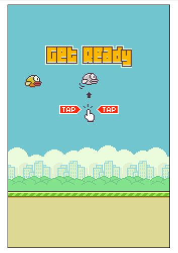
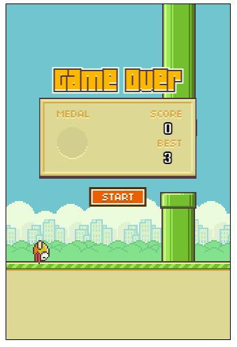

# Игра Flappy bird

Игра сделана на JS canvas. С помощью localStorage способна запоминать лучший результат, в игру добавлены звуки для разных событий. Птица умеет вращаться в зависимости от действия или бездействия игрока, так же она падает вниз с ускорением. Трубы появляются в игре каждые 100 кадров и их расположение высчитывается с помощью Math.random(). Для главного игрового цикла используется requestAnimationFrame() — это позволяет сделать скорость игры независимой от загруженности и скорости компьютера пользователя.
## Screenshots

## Установка

Intsall & Run

Достаточно развернуть в браузере файл index.html

## 🚀 Контакты

Telegram: https://t.me/alekshelis

Email: alekshelis@yandex.ru